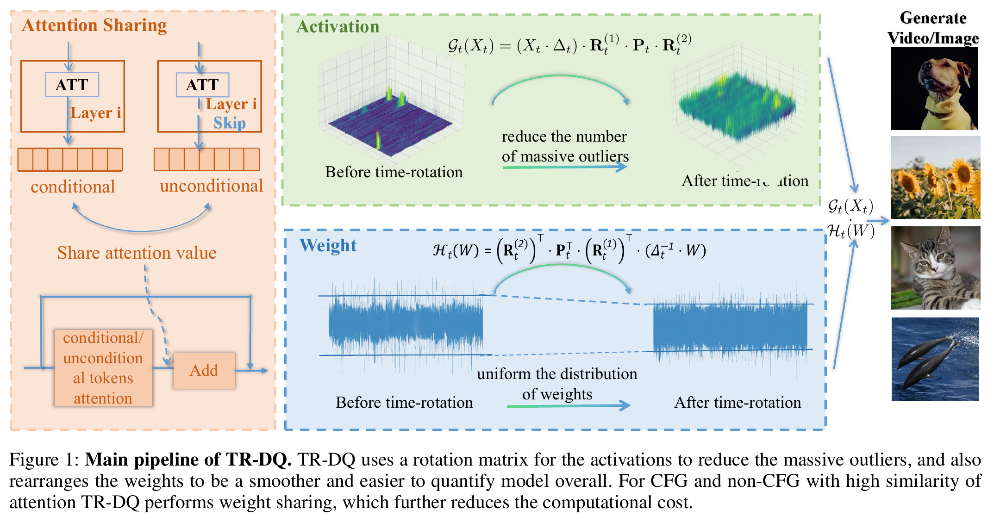

# TR-DQ: Time-Rotation Diffusion Quantization（第四十届 AAAI 人工智能会议录用，AAAI-26）

<h5 align="center"> 如果本项目对你有所帮助，欢迎在 GitHub 上点亮 Star ⭐ 支持我们。🙏🙏 </h5>

## 最新消息

- **[2025.11.08]** 论文被第四十届 AAAI 人工智能会议（AAAI-26）接收。
- 代码即将公开。

<p align="center">
  
</p>

## 环境要求

- Linux、Python 3.10
- PyTorch 2.3.1、CUDA 12.1
- NVIDIA GPU；论文实验使用 A800

PixArt 和 OpenSora 依赖不同版本的 Diffusers，建议使用两个独立环境。

```bash
# PixArt
conda create -n trdq-image python=3.10 -y
conda activate trdq-image
pip install torch==2.3.1 torchvision==0.18.1 --index-url https://download.pytorch.org/whl/cu121
pip install -r requirements/image.txt && pip install -e . --no-deps

# OpenSora
conda create -n trdq-video python=3.10 -y
conda activate trdq-video
pip install torch==2.3.1 torchvision==0.18.1 --index-url https://download.pytorch.org/whl/cu121
pip install -r requirements/video.txt && pip install -e . --no-deps
```

## 预训练模型

| 模型 | 官方下载 | 本地目录 |
| --- | --- | --- |
| PixArt-alpha | [PixArt-alpha/PixArt-alpha](https://huggingface.co/PixArt-alpha/PixArt-alpha) | `checkpoints/pixart_alpha/` |
| OpenSora v1 HQ | [OpenSora-v1-HQ-16x512x512.pth](https://huggingface.co/hpcai-tech/Open-Sora/blob/main/OpenSora-v1-HQ-16x512x512.pth) | `checkpoints/OpenSora-v1-HQ-16x512x512.pth` |
| SD VAE | [stabilityai/sd-vae-ft-ema](https://huggingface.co/stabilityai/sd-vae-ft-ema) | `checkpoints/sd-vae-ft-ema/` |
| T5 | [DeepFloyd/t5-v1_1-xxl](https://huggingface.co/DeepFloyd/t5-v1_1-xxl) | `checkpoints/t5-v1_1-xxl/` |

## 项目结构

```text
.
├── assets/                 # 方法架构图
├── config/                 # W4A8、W8A8 实验配置
├── model/
│   ├── t2i/                # PixArt 校准、PTQ 与推理代码
│   └── t2v/                # OpenSora 校准、PTQ 与推理代码
├── requirements/           # 图像与视频任务的环境依赖
├── test/                   # 轻量级 CPU 测试
├── trdq/quantization/      # TR-DQ 量化器与重建模块
└── utils/                  # 公共工具
```

## 使用方法

以下命令均在仓库根目录执行。

### PixArt-alpha W4A8

```bash
# 1. 生成校准数据
python model/t2i/scripts/get_calib_data.py \
  --version alpha --txt_file model/t2i/asset/calib.txt \
  --pipeline_load_from checkpoints/pixart_alpha \
  --model_path checkpoints/pixart_alpha/PixArt-XL-2-1024-MS.pth \
  --save_path outputs/pixart_alpha/calibration --bs 8

# 2. PTQ
python model/t2i/scripts/ptq.py \
  --version alpha --txt_file model/t2i/asset/calib.txt \
  --pipeline_load_from checkpoints/pixart_alpha \
  --model_path checkpoints/pixart_alpha/PixArt-XL-2-1024-MS.pth \
  --ptq_config config/pixart_alpha/w4a8.yaml \
  --calib_data_path outputs/pixart_alpha/calibration \
  --save_path outputs/pixart_alpha --exp_name w4a8

# 3. 量化推理
python model/t2i/scripts/quant_txt2img.py \
  --version alpha --txt_file model/t2i/asset/coco_1024.txt \
  --pipeline_load_from checkpoints/pixart_alpha \
  --model_path checkpoints/pixart_alpha/PixArt-XL-2-1024-MS.pth \
  --quant_path outputs/pixart_alpha/alpha/w4a8 \
  --save_path outputs/pixart_alpha --quant_weight --quant_act --bs 8
```

### OpenSora W4A8

首先拆分一次融合的 QKV checkpoint：

```bash
python model/t2v/scripts/split_ckpt.py \
  checkpoints/OpenSora-v1-HQ-16x512x512.pth \
  checkpoints/OpenSora-v1-HQ-16x512x512-split.pth
```

```bash
# 1. 生成校准数据
python model/t2v/scripts/get_calib_data.py config/opensora/model.py \
  --ckpt_path checkpoints/OpenSora-v1-HQ-16x512x512-split.pth \
  --outdir outputs/opensora/calibration \
  --save_dir outputs/opensora/calibration --data_num 10 --gpu 0

# 2. PTQ
python model/t2v/scripts/ptq.py config/opensora/model.py \
  --ckpt_path checkpoints/OpenSora-v1-HQ-16x512x512-split.pth \
  --ptq_config config/opensora/w4a8.yaml \
  --calib_data outputs/opensora/calibration/calib_data.pt \
  --outdir outputs/opensora/w4a8 --quant_ckpt_name ckpt.pth --part_fp --gpu 0

# 3. 量化推理
python model/t2v/scripts/quant_txt2video.py config/opensora/model.py \
  --ckpt_path checkpoints/OpenSora-v1-HQ-16x512x512-split.pth \
  --ptq_config config/opensora/w4a8.yaml \
  --quant_ckpt outputs/opensora/w4a8/ckpt.pth \
  --prompt_path model/t2v/assets/texts/t2v_samples_10.txt \
  --outdir outputs/opensora/w4a8 --save_dir outputs/opensora/w4a8/videos \
  --dataset_type opensora --part_fp --gpu 0
```

在最后一条命令中加入 `--attention_sharing` 即可运行 TR-DQ+AS。`config/` 中同时提供 W8A8 配置。

## 引用

```bibtex
@inproceedings{shao2026trdq,
  title={TR-DQ: Time-Rotation Diffusion Quantization},
  author={Shao, Yihua and Lin, Deyang and Yan, Minxi and Chen, Siyu and Zeng, Fanhu and Liao, Minwen and Ma, Ao and Yan, Ziyang and Wang, Haozhe and Wang, Yan and Chen, Zhi and Cao, Xiaofeng and Qin, Haotong and Tang, Hao and Guo, Jingcai},
  booktitle={Proceedings of the AAAI Conference on Artificial Intelligence},
  volume={40}, number={11}, pages={8869--8877}, year={2026}
}
```

## 致谢

感谢以下开源仓库与论文作者的优秀工作。

## 参考资料

### 代码仓库

- [Q-Diffusion](https://github.com/Xiuyu-Li/q-diffusion)
- [ViDiT-Q](https://github.com/thu-nics/ViDiT-Q)
- [PixArt-alpha](https://github.com/PixArt-alpha/PixArt-alpha)
- [Open-Sora](https://github.com/hpcaitech/Open-Sora)

### 论文

- [Q-Diffusion: Quantizing Diffusion Models](https://arxiv.org/abs/2302.04304)
- [ViDiT-Q: Efficient and Accurate Quantization of Diffusion Transformers for Image and Video Generation](https://arxiv.org/abs/2406.02540)
- [PixArt-alpha: Fast Training of Diffusion Transformer for Photorealistic Text-to-Image Synthesis](https://arxiv.org/abs/2310.00426)
- [Open-Sora: Democratizing Efficient Video Production for All](https://arxiv.org/abs/2412.20404)
